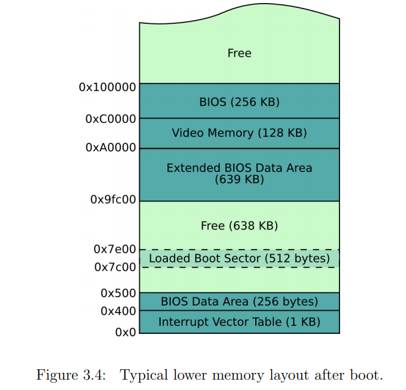

*一些你可能需要提前了解的名词：内存偏移、指针*

**目标：学习计算机内存的组织方式**

Please open page 14 [of this document](
http://www.cs.bham.ac.uk/~exr/lectures/opsys/10_11/lectures/os-dev.pdf)<sup>1</sup>
and look at the figure with the memory layout.
请仔细查看下图所描述的内存布局：


这个教程的唯一目的就是要让大家了解启动扇区在内存中的位置。

我可以直截了当地告诉你，BIOS将启动分区（boot sector）放在`0x7C00`位置并执行这段程序，但是如果多尝试几种可能将使事情更清楚。 

我们想要把X打在屏幕上，我们猜测4种可能的内存布局，然后做实验看哪个可以工作。

**打开`boot_sect_memory.asm`文件**

首先，我们要定义要打印的数据"X"并用label来标识它：
```nasm
the_secret:
    db "X"
```

我们将使用如下的4种方式来访问`the_secret`数据：

1. `mov al, the_secret`，无法打印，因为打印的是the_secret的指针，而不是指针指向的的内存里面的内容。
2. `mov al, [the_secret]`，无法打印，因为没有加上全局偏移，打印the_secret指向的指针的内容。
3. `mov al, the_secret + 0x7C00`，可以打印，因为加上了global offset `0x7C00`。
4. `mov al, 2d + 0x7C00`，可以打印， `2d`是'X'数据存储在二进制文件中的位置。


编译运行`boot_sect_memory.asm`这个文件你将会看到打印出了类似于`1[2¢3X4X`的东西，在字符"1"和字符"2"后面打印的是寄存器中的随机值。

如果你增删了文件中的部分代码，你需要将`0x2d`更换为修改后的数据'X'在二进制文件的位置

请一定要将这章的内容完全理解再继续往下学！

The global offset
-----------------

现在，由于每处都要设置偏移`0x7c00`非常不方便，汇编器给我们提供了`org`命令，这样的话就可以为每个内存位置定义一个"global offset":  

```nasm
[org 0x7c00]
```

**打开`boot_sect_memory_org.asm`文件**，您将看到`org`命令如何影响内存布局。  

请一定要仔细查看两个文件里面的注释。  
-----
